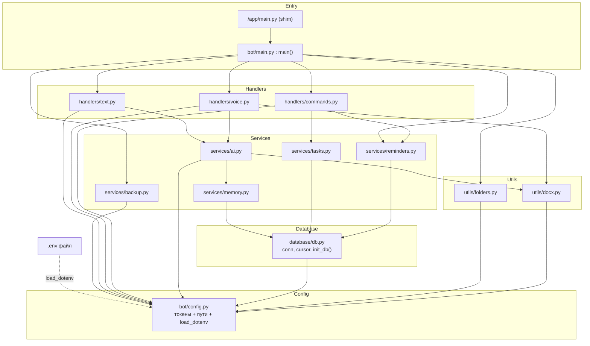
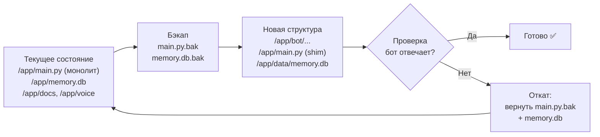

# Design Document

## Overview

Этот документ описывает техническую реализацию двух изменений проекта **Sensei**:

1. **Перенос секретных токенов** (`TELEGRAM_TOKEN`, `OPENAI_API_KEY`) из захардкоженных значений в `main.py` в переменные окружения, загружаемые через `python-dotenv` из файла `.env`.
2. **Рефакторинг монолитного `main.py` (~450 строк) в модульную структуру** без потери какого-либо функционала.

Главный принцип дизайна (взят из правил проекта в `SENSEI_MASTER_CONTEXT_v1.md`):

> **Стабильность > Красота > Новые функции.**
> Никогда не ломать рабочий функционал. Перед любыми изменениями делать резервную копию. Все изменения делать поэтапно. Считать владельца проекта человеком без технического опыта.

Поэтому дизайн построен вокруг трёх гарантий:

- **Нулевая поломка функционала.** Весь текущий функционал (текстовый чат с памятью на 15 сообщений, команды `/task`, `/tasks`, `/remind`, голосовые сообщения через Whisper, генерация DOCX, фоновый цикл напоминаний 30 сек, фоновый цикл бэкапов 1 час, схема SQLite) переносится «один в один».
- **Обратимость.** Оригинальный `main.py` и база данных сохраняются как резервные копии. На любом шаге можно вернуться назад одной командой.
- **Совместимость с продакшеном.** Бот работает в Docker-контейнере `simplerllm` на Oracle Cloud под управлением Supervisor, который запускает `/app/main.py`. Дизайн сохраняет эту точку входа через тонкий «shim» (переходник), чтобы не менять конфигурацию Supervisor/Docker.

### Что НЕ входит в этот спек

Этот спек сфокусирован только на **архитектуре + токенах**. Будущая фаза «проактивный AI super-brain» (бот сам пишет пользователю, отслеживает цели и задачи по сферам жизни) НЕ реализуется здесь, но архитектура спроектирована так, чтобы её можно было добавить как новые модули (`services/proactive.py`, `services/goals.py`, `services/scheduler.py`) **без изменения ядра**. См. раздел [Extensibility](#extensibility-будущая-фаза-super-brain).

### Найденная проблема в текущем коде (важно)

В текущем `main.py` команды обрабатываются по порядку:

```python
if text.startswith("/task"):   # ← ловит И "/task", И "/tasks"
    ...
if text == "/tasks":           # ← сюда поток уже не доходит
    ...
```

Поскольку `"/tasks".startswith("/task")` возвращает `True`, команда `/tasks` фактически перехватывается веткой `/task` и создаёт задачу с текстом `s` вместо вывода списка задач. В модульной версии мы используем точное сопоставление команд (`commands=['tasks']`), что заставляет `/tasks` работать как задумано — выводить список. Это не поломка, а исправление скрытого бага, но я выношу его явно, чтобы вы знали об изменении поведения.

---

## Architecture

### Принцип слоёв

Код разделён на слои с однонаправленными зависимостями (стрелка = «зависит от»):

```
Entry (main.py)  →  Handlers  →  Services  →  Database
                          ↘         ↓            ↑
                            Utils   Config ──────┘
```

- **Entry** — точка входа, собирает приложение и запускает polling + фоновые потоки.
- **Handlers** — принимают сообщения Telegram и вызывают сервисы. Не содержат бизнес-логики.
- **Services** — бизнес-логика (AI, память, задачи, напоминания, бэкапы).
- **Database** — соединение с SQLite и создание таблиц.
- **Config** — единственный источник токенов и путей. Его импортируют все слои.
- **Utils** — вспомогательные функции (создание папок, генерация DOCX).

Правило: слой может зависеть только от слоёв ниже себя. Это гарантирует, что добавление нового хэндлера или сервиса не затрагивает ядро (требование 7.3).

### Component Diagram



### Target File Tree

```
/app/
├── .env                      # реальные токены (НЕ в git)
├── .env.example              # шаблон с placeholder-значениями
├── .gitignore                # игнорирует .env, data/, __pycache__
├── requirements.txt          # + python-dotenv
├── STRUCTURE.md              # документация структуры (требование 7.1)
├── main.py                   # SHIM: from bot.main import main; main()
├── bot/
│   ├── __init__.py
│   ├── main.py               # точка входа: main()
│   ├── config.py             # Config_Loader: токены, пути, load_dotenv
│   ├── handlers/
│   │   ├── __init__.py
│   │   ├── text.py           # текстовые сообщения (не команды) → AI
│   │   ├── voice.py          # голос → Whisper → AI → DOCX
│   │   └── commands.py       # /task, /tasks, /remind
│   ├── services/
│   │   ├── __init__.py
│   │   ├── ai.py             # OpenAI клиент, SYSTEM_PROMPT, ask_ai()
│   │   ├── memory.py         # save_memory(), load_memory()
│   │   ├── tasks.py          # add_task(), list_tasks()
│   │   ├── reminders.py      # add_reminder(), reminder_loop()
│   │   └── backup.py         # backup_loop()
│   ├── database/
│   │   ├── __init__.py
│   │   └── db.py             # conn, cursor, init_db()
│   └── utils/
│       ├── __init__.py
│       ├── folders.py        # ensure_folders()
│       └── docx.py           # save_docx(), save_voice_transcript()
└── data/
    ├── memory.db             # перенесённая БД (см. миграцию)
    ├── backups/              # копии БД (раз в час)
    ├── docs/                 # сгенерированные DOCX
    └── voice/                # временные ogg/wav файлы
```

> **Примечание о `/app/main.py` (shim).** Требование 5.3 говорит, что единственная точка входа — `bot/main.py`. Файл `/app/main.py` — это не вторая точка входа, а тонкий переходник в одну строку, который вызывает `bot.main.main()`. Он нужен только для совместимости с Supervisor, который уже настроен запускать `/app/main.py`. Вся логика запуска живёт в `bot/main.py`.

> **Примечание о папке `config/`.** Требование 5.1 упоминает каталог `config/`. В этой реализации конфигурация — это один модуль `bot/config.py` плюс файлы `.env` / `.env.example` в корне (стандартный паттерн для python-dotenv). Отдельный каталог `config/` не создаётся, чтобы не плодить пустые папки и сохранить «плоскую» структуру (требование 5.7). Это сознательное упрощение; если в будущем настроек станет много, можно добавить `bot/config/` пакет без изменения интерфейса.

> **Примечание о неиспользуемых папках.** Текущий код создаёт 10 папок (`memory`, `voice`, `tasks`, `reminders`, `brain`, `finance`, `goals`, `habits`, `backups`, `docs`), но реально пишет только в `voice/`, `docs/`, `backups/` и `memory.db`. Остальные 7 папок всегда пустые (все данные лежат в SQLite). В новой структуре создаются только реально используемые папки. Это не влияет на функционал.

---

## Components and Interfaces

Ниже — ответственность каждого модуля и сигнатуры ключевых функций. Логика внутри функций переносится из текущего `main.py` без изменений (кроме явно описанных).

### `bot/config.py` — Config_Loader

Единственный источник токенов и путей. Загружает `.env`, читает переменные окружения, падает с понятной ошибкой при отсутствии токена.

```python
import os, sys
from pathlib import Path

try:
    from dotenv import load_dotenv
except ImportError:
    print("ОШИБКА: не установлена библиотека 'python-dotenv'. "
          "Установите её командой: pip install python-dotenv")
    sys.exit(1)

# Корень проекта = /app (config.py лежит в /app/bot/)
BASE_DIR: Path = Path(__file__).resolve().parent.parent

# Каталог данных. По умолчанию /app/data, можно переопределить через env.
DATA_DIR: Path = Path(os.environ.get("SENSEI_DATA_DIR", str(BASE_DIR / "data")))
DB_PATH: Path = DATA_DIR / "memory.db"
VOICE_DIR: Path = DATA_DIR / "voice"
DOCS_DIR: Path = DATA_DIR / "docs"
BACKUPS_DIR: Path = DATA_DIR / "backups"

# Загружаем .env, НЕ перезаписывая уже существующие системные переменные.
load_dotenv(dotenv_path=BASE_DIR / ".env", override=False)

def _require_env(name: str) -> str:
    """Возвращает значение переменной окружения или завершает процесс с ошибкой."""
    value = os.environ.get(name, "").strip()
    if not value:
        print(f"ОШИБКА: переменная окружения {name} не задана. "
              f"Добавьте {name}=<значение> в файл .env или в окружение Docker.")
        sys.exit(1)
    return value

# Последовательная проверка: сначала TELEGRAM_TOKEN, потом OPENAI_API_KEY (требование 1.5).
TELEGRAM_TOKEN: str = _require_env("TELEGRAM_TOKEN")
OPENAI_API_KEY: str = _require_env("OPENAI_API_KEY")
```

**Закрывает требования:** 1.1, 1.2, 1.3, 1.4, 1.5, 1.6, 2.5, 4.3, 8.2, 8.3.

### `bot/database/db.py` — Database

Создаёт соединение SQLite и таблицы. Сохраняет `check_same_thread=False` (нужно для фоновых потоков). Гарантирует, что `DATA_DIR` существует ДО подключения (sqlite не создаёт каталоги).

```python
import sqlite3
from bot import config

def get_connection() -> sqlite3.Connection:
    config.DATA_DIR.mkdir(parents=True, exist_ok=True)
    return sqlite3.connect(str(config.DB_PATH), check_same_thread=False)

def init_db(connection: sqlite3.Connection) -> None:
    """Создаёт таблицы memory, tasks, reminders, если их нет (схема без изменений)."""
    ...

# Общие на весь процесс объекты (как в оригинале)
conn: sqlite3.Connection = get_connection()
cursor: sqlite3.Cursor = conn.cursor()
init_db(conn)
```

**Закрывает требования:** 5.6, 6.6.

### `bot/services/memory.py`

```python
def save_memory(user_id, role: str, content: str) -> None: ...
def load_memory(user_id, limit: int = 15) -> list[dict]: ...
```

Логика идентична оригиналу: сохраняет роль/контент с меткой времени; загружает последние `limit=15` сообщений в хронологическом порядке. **Закрывает:** 6.2 (память на 15 сообщений).

### `bot/services/ai.py`

```python
from openai import OpenAI
from bot import config

client = OpenAI(api_key=config.OPENAI_API_KEY)
SYSTEM_PROMPT: str = """..."""   # переносится из main.py без изменений

def ask_ai(user_id, text: str) -> str:
    """Сохраняет сообщение в память, вызывает gpt-4.1-mini с системным
    промптом + историей, сохраняет ответ, генерирует DOCX, возвращает ответ."""
    ...
```

**Закрывает:** 6.2, 6.7 (DOCX на каждый ответ AI). Модель (`gpt-4.1-mini`, `whisper-1`) и `SYSTEM_PROMPT` сохраняются дословно.

### `bot/services/tasks.py`

```python
def add_task(user_id, task_text: str) -> None: ...
def list_tasks(user_id) -> list[tuple]:
    """Возвращает [(id, task), ...] для активных задач пользователя."""
    ...
```

**Закрывает:** 6.1 (`/task`, `/tasks`).

### `bot/services/reminders.py`

```python
def add_reminder(user_id, remind_time: str, reminder_text: str) -> None: ...
def reminder_loop(bot) -> None:
    """Бесконечный цикл: каждые 30 секунд ищет напоминания с remind_time<=now
    и sent=0, отправляет их и помечает sent=1. Широкий try/except + sleep(30)."""
    ...
```

`bot` передаётся аргументом (а не глобально), чтобы убрать циклическую зависимость хэндлеров и main. **Закрывает:** 6.1 (`/remind`), 6.4 (интервал 30 сек).

### `bot/services/backup.py`

```python
def backup_loop() -> None:
    """Бесконечный цикл: каждый час копирует config.DB_PATH в
    config.BACKUPS_DIR/backup_<timestamp>.db. Широкий try/except + sleep(3600)."""
    ...
```

**Закрывает:** 6.5 (интервал 1 час).

### `bot/utils/folders.py`

```python
def ensure_folders() -> None:
    """Создаёт DATA_DIR, VOICE_DIR, DOCS_DIR, BACKUPS_DIR (exist_ok=True)."""
    ...
```

### `bot/utils/docx.py`

```python
def save_docx(user_id, user_text: str, ai_text: str) -> str:
    """Создаёт DOCX с диалогом в DOCS_DIR, возвращает путь."""
    ...
def save_voice_transcript(user_id, text: str) -> str:
    """Создаёт DOCX с транскриптом голоса, возвращает путь."""
    ...
```

**Закрывает:** 6.7.

### `bot/handlers/text.py`

```python
from bot.services.ai import ask_ai

def register(bot) -> None:
    @bot.message_handler(func=lambda m: m.content_type == 'text'
                                        and not m.text.startswith('/'))
    def handle_text(message):
        try:
            ai_text = ask_ai(message.chat.id, message.text)
            bot.reply_to(message, ai_text)
        except Exception as e:
            bot.reply_to(message, f"Ошибка:\n{e}")
```

Фильтр `not m.text.startswith('/')` гарантирует, что команды обрабатываются ТОЛЬКО в `commands.py`, без двойной обработки. **Закрывает:** 6.2.

### `bot/handlers/commands.py`

```python
from bot.services.tasks import add_task, list_tasks
from bot.services.reminders import add_reminder

def register(bot) -> None:
    @bot.message_handler(commands=['task'])
    def cmd_task(message): ...      # текст после "/task" → add_task()

    @bot.message_handler(commands=['tasks'])
    def cmd_tasks(message): ...     # list_tasks() → форматированный список

    @bot.message_handler(commands=['remind'])
    def cmd_remind(message): ...    # "время | текст" → add_reminder(),
                                    # формат при ошибке: "/remind 2026-05-25 18:00 | Текст"
```

Текст аргумента команды извлекается как `message.text.split(maxsplit=1)[1]` (если есть). Точное сопоставление команд исправляет коллизию `/task`↔`/tasks` (см. Overview). **Закрывает:** 6.1.

### `bot/handlers/voice.py`

```python
from bot.services.ai import ask_ai
from bot.utils.docx import save_voice_transcript
from bot import config

def register(bot) -> None:
    @bot.message_handler(content_types=['voice'])
    def handle_voice(message): ...
    # скачать ogg → config.VOICE_DIR, конвертировать в wav через pydub,
    # whisper-1 транскрипция, ask_ai(), DOCX транскрипт, отправка документа и ответа
```

**Закрывает:** 6.3.

### `bot/main.py` — Main_Entry

```python
import threading
import telebot
from bot import config
from bot.database import db            # импорт создаёт conn + таблицы
from bot.utils.folders import ensure_folders
from bot.handlers import text, voice, commands
from bot.services.reminders import reminder_loop
from bot.services.backup import backup_loop

def main() -> None:
    ensure_folders()
    bot = telebot.TeleBot(config.TELEGRAM_TOKEN)
    text.register(bot)
    voice.register(bot)
    commands.register(bot)
    threading.Thread(target=reminder_loop, args=(bot,), daemon=True).start()
    threading.Thread(target=backup_loop, daemon=True).start()
    print("AI OS STARTED")
    bot.infinity_polling()

if __name__ == "__main__":
    main()
```

**Закрывает:** 3.3, 5.3, 6.4, 6.5.

### `/app/main.py` — Compatibility Shim

```python
# Переходник для совместимости с Supervisor (он запускает /app/main.py).
# Вся логика — в bot/main.py.
from bot.main import main

if __name__ == "__main__":
    main()
```

Когда Supervisor выполняет `python3 /app/main.py`, каталог `/app` попадает в `sys.path`, поэтому `import bot...` находит пакет `/app/bot/`. **Закрывает:** 4.2, 4.4 (точка входа не меняется → конфиг Supervisor не трогаем).

---

## Data Models

### Конфигурационная модель (in-memory)

Конфигурация — это набор констант уровня модуля в `config.py`:

| Имя | Тип | Источник | Назначение |
|-----|-----|----------|------------|
| `TELEGRAM_TOKEN` | `str` | env / `.env` | Токен Telegram-бота |
| `OPENAI_API_KEY` | `str` | env / `.env` | Ключ OpenAI |
| `BASE_DIR` | `Path` | вычисляется | Корень проекта (`/app`) |
| `DATA_DIR` | `Path` | env `SENSEI_DATA_DIR` или `BASE_DIR/data` | Каталог данных |
| `DB_PATH` | `Path` | вычисляется | Путь к `memory.db` |
| `VOICE_DIR` / `DOCS_DIR` / `BACKUPS_DIR` | `Path` | вычисляются | Подкаталоги данных |

### SQLite-схема (переносится БЕЗ изменений — требование 6.6)

```sql
CREATE TABLE IF NOT EXISTS memory (
    id INTEGER PRIMARY KEY AUTOINCREMENT,
    user_id TEXT,
    role TEXT,
    content TEXT,
    created_at TEXT
);

CREATE TABLE IF NOT EXISTS tasks (
    id INTEGER PRIMARY KEY AUTOINCREMENT,
    user_id TEXT,
    task TEXT,
    status TEXT,
    created_at TEXT
);

CREATE TABLE IF NOT EXISTS reminders (
    id INTEGER PRIMARY KEY AUTOINCREMENT,
    user_id TEXT,
    reminder TEXT,
    remind_time TEXT,
    sent INTEGER DEFAULT 0
);
```

### Файл `.env` и `.env.example`

`.env` (реальные значения, в `.gitignore`):
```
TELEGRAM_TOKEN=8459988161:AAF6xv8KlupVBmr-RPzmq6nVYUrPPYQHHV0
OPENAI_API_KEY=sk-proj-...
```

`.env.example` (шаблон, коммитится в git):
```
TELEGRAM_TOKEN=your-telegram-bot-token-here
OPENAI_API_KEY=your-openai-api-key-here
```

`.gitignore`:
```
.env
data/
__pycache__/
*.pyc
*.bak
```

**Закрывает:** 2.1, 2.2, 2.3, 2.4.

---

## Migration Strategy

Стратегия рассчитана на **нетехнического владельца**: каждый шаг обратим, перед изменениями делаются резервные копии, бот можно вернуть к рабочему состоянию одной командой. Миграция делится на две части: подготовка локально и развёртывание на VPS.

### Принцип безопасности

1. **Сначала бэкап, потом изменения.** Оригинальный `main.py` и `memory.db` копируются до любых правок.
2. **Бот не трогаем, пока новая версия не готова.** Старый контейнер продолжает работать всё время подготовки.
3. **Короткий рестарт вместо простоя.** Переключение = `docker stop` → подмена файлов → `docker start`. Это секунды, а не часы (требование 4.4).
4. **Откат в одну команду.** Если что-то пошло не так — восстанавливаем `main.py.bak` и `memory.db`, перезапускаем контейнер.

### Diagram: миграция данных



### Шаг 0 — Резервная копия (обязательно)

Внутри контейнера (`docker exec -it simplerllm bash`):
```bash
cp /app/main.py /app/main.py.bak
cp /app/memory.db /app/memory.db.bak
```
Дополнительно скачать копию `memory.db` к себе на ноутбук через Portainer (на случай проблем с самим контейнером).

### Шаг 1 — Подготовка новой структуры (локально, бот ещё работает)

1. Создать дерево каталогов `bot/`, `bot/handlers/`, `bot/services/`, `bot/database/`, `bot/utils/`, `data/`.
2. Разнести код из `main.py` по модулям согласно разделу Components and Interfaces. Логику переносить дословно.
3. Создать `bot/__init__.py` и `__init__.py` во всех подпакетах (пустые файлы — делают каталоги Python-пакетами).
4. Создать `/app/main.py` как shim (3 строки).
5. Создать `.env`, `.env.example`, `.gitignore`, `STRUCTURE.md`.
6. Добавить `python-dotenv` в `requirements.txt`.

### Шаг 2 — Миграция данных под `data/`

Цель: перенести существующие `memory.db` и папки в `data/`, **не потеряв данные**.

```bash
mkdir -p /app/data/backups /app/data/docs /app/data/voice
# перенос базы (mv, не cp — чтобы не было двух источников правды)
mv /app/memory.db /app/data/memory.db
# перенос истории документов и старых бэкапов (если важны)
mv /app/docs/*   /app/data/docs/   2>/dev/null || true
mv /app/backups/* /app/data/backups/ 2>/dev/null || true
```

Резервная копия `memory.db.bak` остаётся в `/app/` как страховка.

**Альтернатива без переноса БД (ещё безопаснее):** если перемещать рабочую `memory.db` страшно, можно оставить её на месте и указать боту старый путь через переменную окружения:
```
SENSEI_DATA_DIR=/app
```
Тогда `config.DATA_DIR` укажет на `/app`, и бот продолжит читать `/app/memory.db`. Папки `docs/`, `voice/`, `backups/` тоже останутся в `/app`. Это даёт постепенный переход: сначала код модульный, данные на старом месте; перенос данных можно сделать позже отдельным шагом. Параметр `SENSEI_DATA_DIR` существует именно для этого.

### Шаг 3 — Установка зависимости

```bash
pip install python-dotenv
```
(или `pip install -r requirements.txt`). Если шаг пропустить, бот сразу при старте выдаст понятное сообщение об отсутствии `python-dotenv` (требование 8.3).

### Шаг 4 — Переключение (короткий рестарт)

```bash
docker stop simplerllm
# загрузить новые файлы в /app (через Portainer или docker cp)
docker start simplerllm
docker logs simplerllm   # ожидаем строку "AI OS STARTED"
```

Supervisor запускает тот же `/app/main.py` (теперь shim) → конфигурацию Supervisor/Docker менять НЕ нужно (требование 4.2). Точка входа снаружи не изменилась.

### Шаг 5 — Проверка (см. Testing Strategy)

Прогнать чек-лист дымовых проверок. Если бот отвечает и команды работают — миграция завершена.

### Откат (если что-то сломалось)

```bash
docker stop simplerllm
cp /app/main.py.bak /app/main.py          # вернуть монолит
cp /app/main.py.bak /app/main_monolith.py # на всякий случай
# если переносили БД и она повреждена:
cp /app/memory.db.bak /app/data/memory.db  # или /app/memory.db
docker start simplerllm
```
Поскольку старый `main.py` самодостаточен (содержит хардкод-токены), откат полностью восстанавливает рабочую версию. После успешной миграции `.bak`-файлы можно удалить (но лучше хранить пару недель).

---

## Error Handling

| Ситуация | Поведение | Требование |
|----------|-----------|------------|
| Нет `TELEGRAM_TOKEN` | `config.py` печатает понятное сообщение и `sys.exit(1)` (fail-fast) | 1.3 |
| Нет `OPENAI_API_KEY` | то же; проверка последовательная, падаем на первом отсутствующем | 1.4, 1.5 |
| Не установлен `python-dotenv` | `ImportError` перехватывается в `config.py`, печатается инструкция по установке, `sys.exit(1)` | 8.3 |
| Системная env и `.env` заданы одновременно | `load_dotenv(override=False)` — приоритет у системной переменной, даже если та пустая/некорректная (`.strip()` в `_require_env` поймает пустую) | 4.3 |
| Ошибка в обработке текстового сообщения | `try/except` в хэндлере → `bot.reply_to(message, f"Ошибка:\n{e}")` (как в оригинале) | 6.2 |
| Ошибка в обработке голоса | `try/except` → `bot.reply_to(message, f"Voice error:\n{e}")` | 6.3 |
| Неверный формат `/remind` | `try/except` → подсказка формата `/remind 2026-05-25 18:00 | Текст` | 6.1 |
| Сбой в `reminder_loop` / `backup_loop` | широкий `try/except` внутри цикла + `sleep`, поток-демон не падает (как в оригинале) | 6.4, 6.5 |
| Каталог `data/` отсутствует | `ensure_folders()` и `get_connection()` создают его с `exist_ok=True` до обращения к БД | — |

Принцип сохранён из оригинала: ошибки runtime внутри хэндлеров и фоновых циклов не должны ронять бот; ошибки конфигурации (нет токена/библиотеки) должны останавливать запуск немедленно и явно.

---

## Testing Strategy

### Применимость property-based тестирования (PBT)

**PBT для этой фичи НЕ применяется.** Обоснование по правилам выбора:

- Фича состоит из **(а) загрузки конфигурации** (чтение env-переменных, fail-fast), **(б) структурного рефакторинга** (перенос кода по модулям) и **(в) документации** (`STRUCTURE.md`, `.env.example`).
- Здесь нет чистых функций с большим пространством входов и универсальных свойств вида «для всех входов X выполняется P(X)». Поведение конфигурации детерминировано: токен либо задан, либо нет. Рефакторинг проверяется сравнением поведения «до/после», а не генерацией случайных входов.
- Согласно методике, конфигурационная валидация → schema/example-тесты; перенос/обёртки и I/O (Telegram, OpenAI, файлы, SQLite) → example- и интеграционные тесты с моками.

Поэтому раздел **Correctness Properties опущен намеренно**, а стратегия строится на **unit-тестах с моками** (для логики конфигурации) и **дымовых/интеграционных проверках** (для сохранности функционала после миграции).

### Уровень 1 — Unit-тесты конфигурации (автоматизируемо, с моками)

Тестируется единственная нетривиальная логика — `config._require_env` и порядок проверок. Используется `monkeypatch` для env и подмена `.env`.

| Тест | Сценарий | Ожидание |
|------|----------|----------|
| `test_missing_telegram_token_exits` | env пуст | `SystemExit`, сообщение упоминает `TELEGRAM_TOKEN` |
| `test_missing_openai_token_exits` | задан только `TELEGRAM_TOKEN` | `SystemExit`, сообщение упоминает `OPENAI_API_KEY` |
| `test_sequential_check_order` | оба отсутствуют | падает первым на `TELEGRAM_TOKEN` (требование 1.5) |
| `test_system_env_overrides_dotenv` | в env и в `.env` разные значения | используется значение из системной env (требование 4.3) |
| `test_empty_system_env_not_overridden_by_dotenv` | системная env пустая, `.env` заполнен | пустая системная env имеет приоритет → fail-fast (требование 4.3) |
| `test_tokens_loaded_from_dotenv` | env пуст, `.env` заполнен | токены успешно прочитаны (требования 1.1, 1.2, 1.6, 2.5) |
| `test_no_hardcoded_tokens` | grep по `bot/` и `main.py` | нет строк, похожих на реальные токены (`sk-`, цифровой:Buk) в исходниках (требования 3.1, 3.2) |

Библиотека: `pytest` + `monkeypatch`. Внешние вызовы (OpenAI, Telegram) не нужны — `config.py` их не делает.

### Уровень 2 — Дымовые проверки миграции (ручной чек-лист после Шага 4)

Эти проверки подтверждают «нулевую поломку функционала» (требование 6.x) на живом боте. Для нетехнического владельца — простой список «сделай в Telegram, убедись в результате»:

| # | Действие в Telegram | Ожидаемый результат | Требование |
|---|--------------------|--------------------|-----------|
| 1 | Написать любое текстовое сообщение | Бот отвечает осмысленно (AI работает), помнит предыдущие сообщения | 6.2 |
| 2 | Отправить 16+ сообщений, сослаться на первое | Помнит последние 15 (контекст памяти) | 6.2 |
| 3 | `/task Купить молоко` | «✅ Задача добавлена» | 6.1 |
| 4 | `/tasks` | Список активных задач (а не создание задачи!) | 6.1 |
| 5 | `/remind 2099-01-01 10:00 | Тест` | «⏰ Напоминание сохранено» | 6.1 |
| 6 | `/remind кривой ввод` | Подсказка формата | 6.1 |
| 7 | Отправить голосовое | Транскрипт + AI-ответ + DOCX-файл | 6.3, 6.7 |
| 8 | Проверить логи через минуту | Цикл напоминаний работает (нет падений) | 6.4 |
| 9 | Подождать/проверить `data/backups/` | Появляется `backup_*.db` (раз в час) | 6.5 |
| 10 | `docker logs simplerllm` | Есть строка `AI OS STARTED`, нет трейсбэков | — |

### Уровень 3 — Интеграционные проверки данных

| Проверка | Как | Требование |
|----------|-----|-----------|
| Схема БД сохранена | `sqlite3 data/memory.db ".schema"` → таблицы `memory`, `tasks`, `reminders` без изменений | 6.6 |
| Данные не потеряны | `SELECT count(*) FROM memory;` до и после миграции совпадает | 6.6 |
| `.env` не в git | `git status` не показывает `.env`; `git check-ignore .env` подтверждает | 2.4 |
| Запуск без токенов падает | в чистом окружении без env и без `.env` — бот завершается с понятной ошибкой | 1.3, 1.4 |
| Docker `--env-file` | контейнер стартует с `--env-file .env`, бот аутентифицируется | 4.1, 4.2 |

### Что НЕ тестируем автоматически

- Реальные вызовы OpenAI/Telegram API (стоимость, сеть, внешние сервисы) — проверяются дымовыми тестами вручную.
- Поведение Supervisor/Docker — проверяется одной проверкой запуска (smoke), не повторяется.

---

## Extensibility (будущая фаза «super-brain»)

Архитектура подготовлена к будущей проактивной фазе **без изменения ядра** (требование 7.3). Когда придёт время, бот сможет сам инициировать сообщения, отслеживать цели и задачи по сферам жизни, спрашивать о прогрессе. Это добавляется как новые файлы:

```
bot/services/
├── proactive.py     # логика: когда и о чём писать пользователю самому
├── goals.py         # цели по сферам жизни (финансы, здоровье, навыки...)
└── scheduler.py     # планировщик проактивных действий (расширение фоновых циклов)
```

Точки расширения, заложенные в текущем дизайне:

- **Сервисы изолированы от хэндлеров.** Новый `proactive.py` использует тот же `database/db.py` и `services/ai.py`, ничего в них не меняя.
- **`bot` передаётся аргументом** в фоновые циклы (`reminder_loop(bot)`), поэтому проактивный планировщик сможет так же получить `bot` и слать сообщения по своей инициативе.
- **Регистрация в `main.py` аддитивна.** Добавление нового сервиса = одна строка запуска потока/планировщика в `main()`, существующие модули не трогаются.
- **`config.py` — единая точка настроек.** Новые параметры (интервалы проактивности, ID пользователя для инициативных сообщений) добавляются как новые константы без изменения интерфейса.
- **Новые таблицы** (`goals`, `life_spheres`) добавляются в `init_db()` через `CREATE TABLE IF NOT EXISTS` — существующие данные не затрагиваются.

Этот раздел — ориентир на будущее; в рамках ТЕКУЩЕГО спека эти модули не создаются.

---

## Requirements Coverage

| Требование | Где закрыто в дизайне |
|-----------|----------------------|
| 1.1–1.6 | `config.py` (load_dotenv, `_require_env`, последовательная проверка) |
| 2.1–2.5 | `.env`, `.env.example`, `.gitignore`, Data Models |
| 3.1–3.4 | удаление хардкода, импорт через `config`, дымовые тесты функционала |
| 4.1–4.4 | shim `/app/main.py`, `override=False`, стратегия короткого рестарта |
| 5.1–5.7 | Target File Tree, слои Architecture, плоская структура |
| 6.1–6.7 | Components and Interfaces (перенос логики 1:1), дымовой чек-лист |
| 7.1–7.3 | `STRUCTURE.md`, дерево файлов, раздел Extensibility |
| 8.1–8.3 | `python-dotenv` в requirements.txt, обработка `ImportError` |
